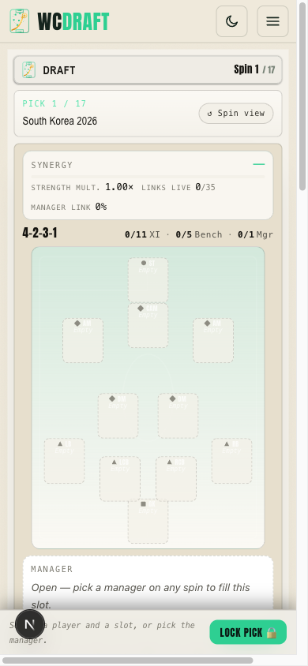
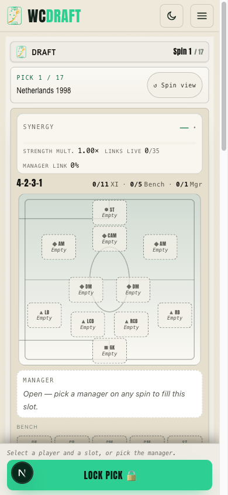
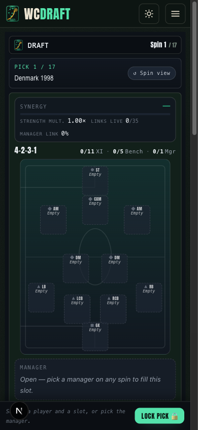
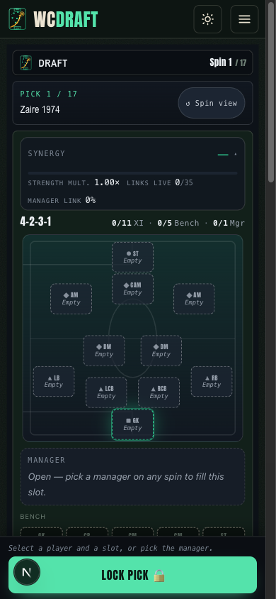
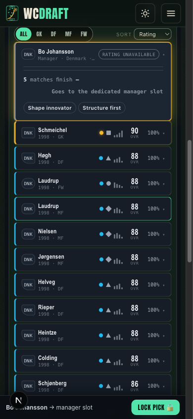
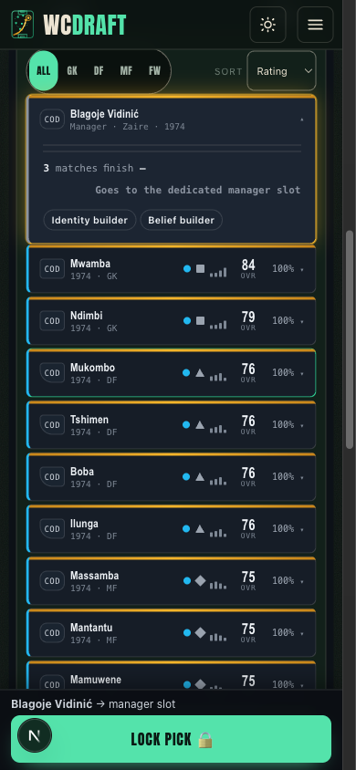
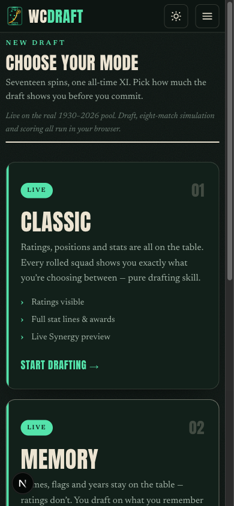
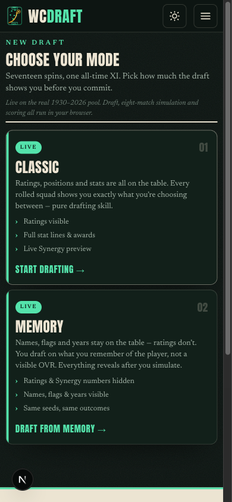
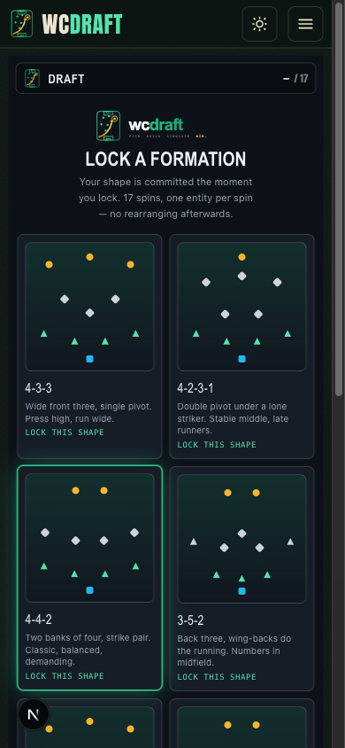
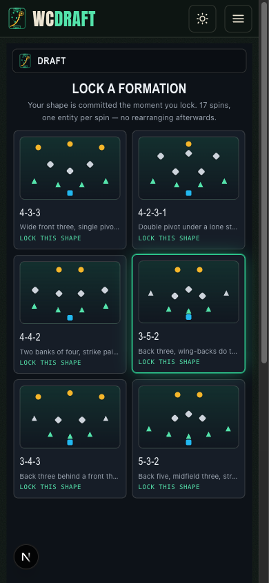

# ws-ux/mobile-polish-1 — Mobile UX polish wave (presentation-only)

**Scope:** `apps/web` presentation + `apps/web/app/ds/tokens.css`. Zero engine, view-model,
adapter, or blind-seam logic changes. Mobile (390×844) is the primary experience.

## Work items

### 1 — LOCK PICK ergonomics + tap-target audit

- The sticky bottom bar is now mobile-first **column** layout: one compact helper line on
  top, action row below. **LOCK PICK** is a full-prominence primary (`min-height: 52px`,
  `flex: 1`, thumb-zone right / full width when alone); **Choose slot** demoted to a
  fixed-width secondary (also 52px tall). ≥640px relaxes back to a single row with a
  220px-min primary. `safe-area-inset-bottom` respected (pre-existing, preserved).
- Tap-target audit to ≥44×44: candidate rows 38px→**44px** (despite the v3 density pass —
  these are the most-tapped rows in the game), position-filter segments and sort select
  `min-height: 44px`, sheet close 36→44px, "↺ Spin view" 44px, spin CTA `min-height: 52px`,
  pitch chips 59×43px at 390 (container-derived, see item 4), bench 46px, sheet slots 54px.

### 2 — Mode select on one screen

Both Classic and Memory cards (with CTAs) fit a 390×844 **and** 360×800 viewport with no
scroll: compacted card padding/type, 3 one-line ellipsized bullets, inline CTA, and a
`.game-page--mode`-scoped head shave in `globals.css`. No copy changes.

### 3 — Formation picker comparability

All six shapes now sit in one 390×844 viewport in a tight 2-col grid. The mini-pitch
previews (the bulk) went to 16/10; blurbs are one ellipsized line; the redundant in-panel
brand lockup is hidden ≤430px (masthead + app bar already brand the screen). Whole card
remains the tap target with the explicit "Lock this shape" affordance for a11y. The app-bar
"– / 17" counter is now hidden until a draft exists (was a dash-counter that read as broken
state).

### 4 — Pitch slot grid: collision-free by construction

- **Root cause:** chip half-height was assumed 6.0% of pitch height in
  `lib/game/pitch-layout.ts`, but the rendered (content-sized) chip was ~15–16% tall —
  hence GK/CB and ST/CAM collisions. Measured on the old build at 390px (4-2-3-1):
  `GK × LCB (16.7×4.1px)` and `GK × RCB (16.7×4.1px)` real DOM overlaps.
- **Fix:** the pitch is now a CSS inline-size container; chips are sized in `cqw`
  (width 19cqw, height 14cqw on a 100/94 pitch) so chip footprint is a **fixed fraction**
  of the pitch at every width — and the resolver constants (`9.5` / `7.5`) now mirror the
  CSS exactly (contract documented on both sides). Inner content (glyph, label, fit %,
  name, OVR) scales in cqw with px clamps — compaction never clips (fixed height +
  `overflow: hidden` keeps the AABB exact).
- Resolver hardening: clamping moved **inside** each relaxation pass (an edge-pinned GK
  was losing its separation share to the end-clamp and re-colliding with CB) and the pass
  cap raised 6→24 for the dense midfield diamonds (still deterministic, ≤11 chips).
- Vertical compaction: a legacy `min-height: 24rem` (384px) pinned the pitch height; with
  it removed the pitch is 312×293 at 390px (was effectively 296×384) — **~90px shorter**.
- **Programmatic bounding-box check:** all 6 formations × {390, 360} widths measured live
  via `getBoundingClientRect` pairwise intersection — **0 overlaps in 12/12 runs**
  (chips 58.9×43.4 at 390, 55.7×41.0 at 360). The existing
  `pitch-layout.test.ts` suite (13 tests) re-verifies the resolver against the new
  constants in CI.

### 5 — Light theme rework (tokens.css)

- **The bug:** slot labels (`.slotPos`, `.slotEmptyLabel`, empty-slot text and pitch chalk
  lines) were `rgba(255,255,255,…)` literals from the legacy always-dark pitch — invisible
  white-on-pale in light mode (see before/after below).
- **Token-level fix** (no sprinkled literals): new theme-aware pitch tokens
  `--pitch-line`, `--pitch-slot-line`, `--pitch-accent-mute`; all pitch chalk + dashed
  empty-slot borders + the neutral fit-tier accent consume them. Slot label ink now rides
  the ink ramp (`--ink-200`/`--ink-300`), which flips dark in light mode.
- **Full light AA pass in `[data-theme="light"]`:** every accent that renders as text was
  deepened to clear 4.5:1 on `--bg-750/--bg-800` — cyan/teal/ember/gold ramps, the full
  provenance family (+ rgb triples), lock/steel, win/loss/draw/warn/info, position tints —
  and `--ink-400` lifted to 5.5:1. Elevation shadows softened to paper-weight.
- **Dark audit:** `--ink-400` lifted `#6b7480`→`#7d8794` so t-xs labels on `--bg-750`
  clear 4.5:1 (was ~3.7) — the only dark-value change; all other dark tokens untouched.
  Dark screenshots show no regressions.

### 6 — Manager rows

"Rating unavailable" pill removed from the manager **candidate row** — the
"Manager · ⟨nation⟩ · ⟨year⟩" subtitle carries the kind; the expand chevron stays. The
dedicated ManagerSlot card keeps its explicit badge (different surface; documented
honest-state invariant). No tests asserted the row pill (verified by repo-wide grep);
334/334 web tests green.

### 7 — General tightening

- Synergy bar is now **collapsible**: the head row (label + headline score) is a 44px
  toggle; track + figures collapse. Mobile first paint defaults collapsed, ≥720px defaults
  expanded, explicit user toggle persisted (`wcdraft:ui:synergy-bar-open:v1`) and wins.
  Honest-state and blind behavior unchanged (score stays visible in the head).
- Spin-stage drum micro-label hidden ≤430px (duplicated the status-bar title).
- Formation-select / head gaps trimmed; pill/badge rhythm normalized to `2px 8px` +
  `--r-pill` (shirt, drafted, provenance, compat).

### 8 — Discretionary polish (all listed)

- **Synergy headline rounding:** review screen surfaced a raw `9.324675324675324` —
  display now rounds to an integer (fill width + sim untouched). Pre-existing bug.
- **Delta arrows retokened:** `.deltaUp` literal `#3f9e69` → `--teal-deep`; `.deltaDown`
  was using the _accent_ color for a negative delta → `--loss`.
- **`--line-strong` (light)** darkened `#d2cdc0`→`#b9b3a4` and `--line-2` to `.2` alpha so
  hairlines on cream actually read.
- Mode-card hover lift disabled ≤430px (no hover on touch; prevented tap-flicker).

### Proposed, NOT built (structural — out of YELLOW scope)

- Spin-stage "Synergy 0" status chip before any pick reads as a real score; an honest "—"
  there needs a draft-screen logic touch (`revealSynergyOverall` already nullable — one
  conditional in `draft-screen.tsx`, but it gates on engine state semantics).
- The sticky `DraftAppBar` stops sticking once the candidates list scrolls (stacking
  context); a restructure of the shell scroll container would fix it.
- Bottom-sheet slot picker could become a draggable sheet with a grab handle.

## Validation matrix

| Gate                                            | Result                                                                                                                                          |
| ----------------------------------------------- | ----------------------------------------------------------------------------------------------------------------------------------------------- |
| `pnpm typecheck`                                | ✅ 7/7 tasks                                                                                                                                    |
| `pnpm lint` (`--max-warnings=0`)                | ✅ 4/4 tasks                                                                                                                                    |
| Full test suite                                 | ✅ core 302, db 59, data 50, **web 334** — all green                                                                                            |
| Screenshot grid 390×844 + 360×800, light + dark | ✅ 4 combos × home / mode / formation / spin / draft+candidates+bar / review (28 shots, `after/`)                                               |
| Overlap check, all formations, both widths      | ✅ 12/12 zero DOM-rect overlaps (before-baseline: 2 real overlaps on 4-2-3-1)                                                                   |
| Hidden-mode spot probe                          | ✅ 0 rating digits pre-reveal: 26 OVR cells, 4 channels, coverage, synergy figures (expanded) all "—"; fit % + pool count intentionally visible |
| Mode select one-screen                          | ✅ cards + CTAs above the fold at 390×844 and 360×800                                                                                           |
| Hidden seam / view-models                       | ✅ untouched (`adapters.ts`, `view-models.ts`, `memory-reveal.tsx` zero diff)                                                                   |

## Before / after

| Surface                 | Before                                                  | After                                                  |
| ----------------------- | ------------------------------------------------------- | ------------------------------------------------------ |
| Light pitch (the bug)   |                |                |
| Dark pitch + lock bar   |                 |                 |
| Candidates + action bar |  |  |
| Mode select             |                 |                 |
| Formation picker        |            |            |

After-only: spin reveal (light/dark), squad review (light/dark), hidden-mode probe,
360×800 pitch, 360×800 light mode select — in `after/`.
